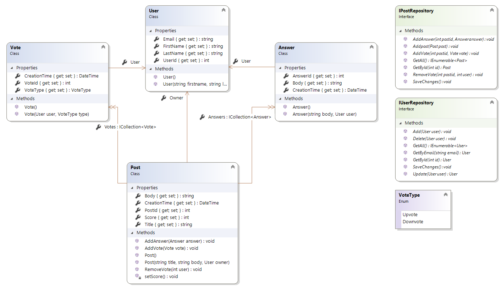
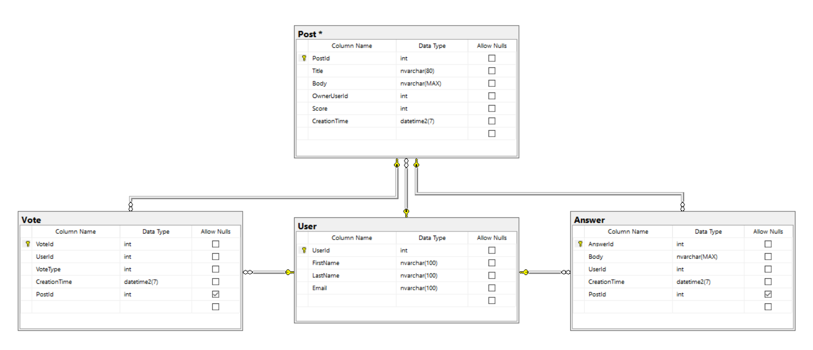

# Stack Overflow Light - API

## About

The backend REST API of my Stack Overflow Light web app.

## Run Project

1.	make sure `.Net core 2.2` is installed
2.	clone this repository
3.	open the solution in Visual Studio 
4.	Run by clicking on `IIS Express`
5.	Start the web app. guide can be found [here](https://github.com/JarneDeschacht/StackOverflow-Light-Frontend)

## Techniques used

-	REST API
-	Entity Framework Core
-	Object Relational Mapping
-	Identity Framework
-	JSON Web Token based authentication
-	SQL Server database
-	Swagger

## Why .Net Core

- I'm used to work with it due to my previous projects
- Cross platform
- Powerful, easy to use API 
- Code first
- Build-in Identity Framework
- Protected backend routes
- Easy to integrate with JWT authentication

## Why JWT Token based Authentication

- JSON is less verbose than XML, so when it is encoded, a JWT is smaller than a SAML token. This makes JWT a good choice to be passed in HTML and HTTP environments.
- More secure
- You can store addidtional data in the tokens

## Domain

## Database diagram

